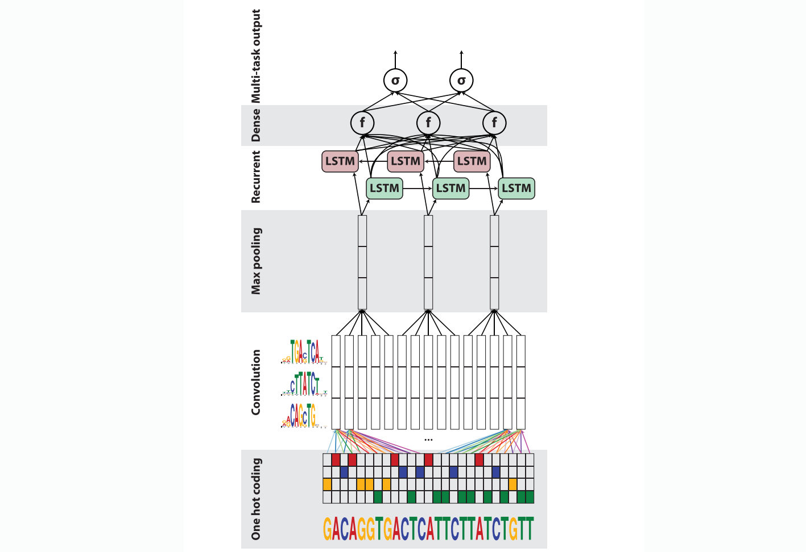

# Deep Learning Applications for Genomics

- `papers` floder consists of papers I read.
- `readings` folder consists of introductory papers or lecture notes for me to learn.

# Useful Resources:
- [Deep Learning in Genomics and Biomedicine, Stanford CS273B](https://canvas.stanford.edu/courses/51037)
- [A List of DL in Biology on Github]( https://github.com/hussius/deeplearning-biology)
- [A List of DL in Biology](https://followthedata.wordpress.com/2015/12/21/list-of-deep-learning-implementations-in-biology/)

# **Contents**

[08/16 DanQ: CNN 1 layer+BLSTM](#0816-danq-cnn-1-layerblstm)

[08/17 DeepCpG: combine 2 CNN sub-models](#0817-deepcpg-combine-2-cnn-sub-models)

[08/18 DeepNano](#0818-deepnano)

# 08/16 DanQ: CNN 1 layer+BLSTM

Quang D, Xie X. [DanQ: a hybrid convolutional and recurrent deep neural network for quantifying the function of DNA sequences](https://www.ncbi.nlm.nih.gov/pmc/articles/PMC4914104/)[J]. Nucleic acids research, 2016, 44(11): e107-e107.

### Model Purpose

DanQ is a powerful method for predicting the function of DNA directly from sequence alone, making it a valuable asset for studying the function of **noncoding DNA**. It

- Modeling the properties and functions of DNA sequences is particularly difficult for non-coding DNA, the vast majority of which is still poorly understood in terms of function. 
- Over 98% of the human genome is non-coding and 93% of disease-associated variants lie in noncoding regions.
### Model Layers

1. **Input: on-hot (of ATCG)**

2. **1 Convolution Layer** 
  Purpose: to scan sequences for motif sites;

3. **1 Max Pooling Layer**

   Pro: It's simple, compared to `3 convolution+2 max pooling` in DeepSEA.

4. **BLSTM**

   Purpose:

   - Motifs can follow a regulatory grammar governed by physical constraints that dictate the in vivo spatial arrangements and frequencies of combinations of motifs, a feature associated with tissue-specific functional elements such as enhancers. (**sequential** )
   - BLSTMs captures long-term dependencies (effective for **sequential** data)
   - BLSTMs success in phoneme classification, speech recognition, machine translation and human action recognition

5. **1 Dense Layer of  ReLU  units**, similar to the DeepSEA

6. **Output: sigmoid**, similar to the DeepSEA

### Model Details

- Initialization: 
  - a) `weights ~ *uniform*(-0.05,0.05) `and `biase = 0` 
  - b) They also tried to y is to initialize kernels from known motifs
- Validation loss(cross-entropy, classification) is evaluated at the end of each training epoch to monitor convergence 
- Dropout is implemented
- Logistic regression Model is trained for benchmark purposes
- **Training Time**: for 320 convolution, 60 epochs, while each takes ~6h.

### Comments

- They use **Precision-Recall AUC**, because given the sparsity of positive binary targets (∼2%), the ROC AUC statistic is highly inflated by the class imbalance, while PR AUC is less prone to inflation by the class imbalance than ROC AUC. This is a fact overlooked in the original DeepSEA paper. 

- DanQ is often compared with DeepSEA, they share datasets, and there are comparison results in DanQ paper.

# 08/17 DeepCpG: combine 2 CNN sub-models
Angermueller, Christof, Heather J. Lee, Wolf Reik, and Oliver Stegle. [*DeepCpG: Accurate Prediction of Single-Cell DNA Methylation States Using Deep Learning.*](http://www.biorxiv.org/content/early/2016/05/27/055715) Genome Biology 18 (April 11, 2017): 67. doi:10.1186/s13059-017-1189-z.

### Introduction

**Purpose**: Predicting DNA methylation states from DNA sequence and *incomplete methylation* profiles in *single cells*.

**Background**: Current protocolsd for assaying DNA methylation in single cells are limited by incomplete CpG coverage. Therefore, finding methods to predict missing methylation states are critical to enable genome-wide analyses. 

**Strength**

- Existing approaches *do not account for cell-to-cell* variability, which is critical for studying epigenetic diversity, though are able to predict average DNA methylation profiles in cell populations.
- Existing approaches require *a priori defined features* and genome annotations, which are typically limited to a narrow set of cell types and conditions.
- A *modular architecture*: do not separate the extraction of DNA sequence features and model training

### Model Layers

**The idea of this paper is similar to DeepMixedModel , they take advantage of two sub-models and use a fusion module to combine the two,**  referred as `modular architecture` in the paper. Both the input and the purpose of two sub-models are different.

The model is comprised of a 

- `CpG module`: accounts for correlations between CpG sites within and across cells

  - Input: Sparse single-cell CpG profiles, where

    `1`: Methylated CpG sites are denoted by ones

    `0`: unmethylated CpG sites by zero

    `?`: CpG sites with missing methylation state by question marks

- `DNA module`(conv+pool): detects informative sequence patterns (predictive sequence motifs)

  - Identifies patters in the CpG neighbourhood across multiple cells, using cell-specific convolution and pooling operations (rows in b)

The two are combined by a
- `Fusion module`: integrates the evidence from the CpG and DNA module to predict
  - models interactions between higher-level features derived form the DNA and CpG 

### Model Details

- Regularization: Elastic Net + Dropout
- mini-batch with SDG
- Theano with Keras
- Training time: 31h = 15h(CpG)+12h(DNA)+4h(fusion)
### Multiple applications of their methods:
- Predict single-cell methylation states / impute missing methylation states
- Analyze the effect of DNA sequence features on DNA methylation and investigate effects of DNA mutations and neighbouring CpG sites on CpG methylation:
  - Discover methylation-associated motifs (conv+pooling)
  - Estimating the effect of single nucleotide mutations on CpG methylation
  - Quantify the effect of epimutations on neighbouring CpG sites, finding a clear relationship between distance and the mutational effect

- Discove DNA sequence motifs that are associated with epigenetic variability

### Comments

- As stated in the paper, the convolutional architecture allows for discovering predictive motifs in larger DNA sequence contexts, as well as for capturing complex methylation patterns in neighbouring CpG sites. (I think the idea is adopted from image processing by DL)
- Modular Architecture
- Contribution: Facilitate the assaying of larger number of cells by
  - enables analysis on low-coverage single-cell methylation data. The accurate imputation of missing methylation states facilitate genome-wide downstream analyses.
  - reduces required sequencing depth in single-cell bisulfite sequencing studies, thereby enabling assaying larger numbers of cells at lower cost. 

# 08/18 DeepNano

Boža V, Brejová B, Vinař T. DeepNano: [Deep recurrent neural networks for base calling in MinION nanopore reads](https://arxiv.org/abs/1603.09195)[J]. PloS one, 2017, 12(6): e0178751.

